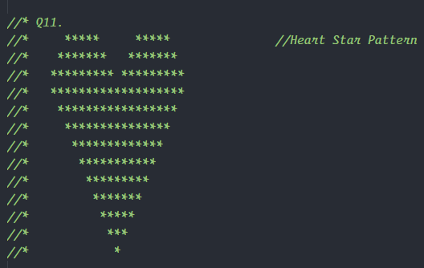
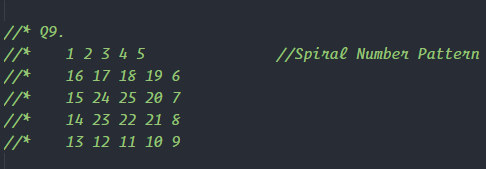
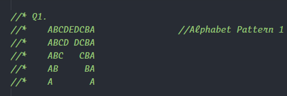

Nested Loops
Loops within loops are termed as nested loops.
Pattern Problems
The easiest way to understand the working of a nested loop is by solving pattern printing
problems.

# Nested Loops
Loops within loops are termed as nested loops.

# Pattern Problems
The easiest way to understand the working of a nested loop is by solving pattern printing
problems.

### Star Pattern

### Number Pattern

### Alphabet Pattern
